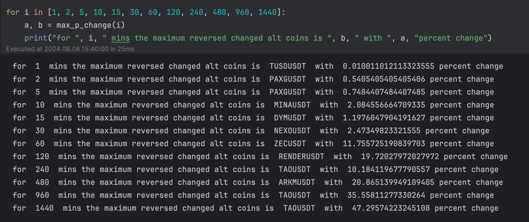

# Top Reversed Alt Coins

1. First, calculate when Bitcoin bottomed out on Monday's Market Crash.
2. Using CoinGecko API get the top 200 Alt Coins.
3. Get price of Alt coins at the timestamp.
4. Get/Calculate the percentage change in the Alt coin from the timestamp for different time periods till 24-hour window using the Binance API.
5. Rank top 10 reversed alt coins for all the time periods.

Time Periods:
`1 min, 2 min, 5 min, 10 min, 15 min, 30 min, 1 hour, 2 hour, 4 hour, 8 hour, 16 hour, 24 hour`

### Install
```bash
python3 -m venv venv
source venv/bin/activate
```

## Notes
* For top 200 alt coins I am using CG API
* Getting only hourly data from CG
* For price data I am using Binance API

# How to use
1. First setup .env file with appropriate API keys as given in .env.sample 
2. Go to bottom of ./main.ipynb 
3. Edit parameters of max_p_change function to how many minutes you want as time period for reversal of alt coin
4. Run the file

# Output
Final output 



# New Idea
Could use symbols from 

### ERRORs IN CALCULATION
* Binance API only provides BTC/USDT pair, there will be error coming from USD/USDT pair.
* Couldn't find proper way to connect top crypto with the pair on Binance

